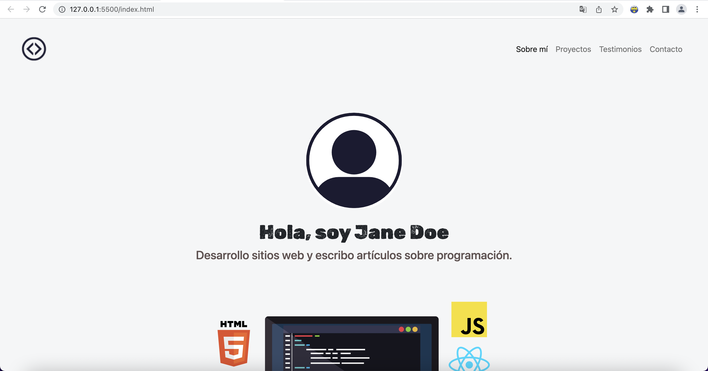

# Portafolio Adaptable (Responsive) con Bootstrap 5

Este proyecto creado para el bootcamp Tecnolochicas PRO, es una página web adaptable a dispositivos de distintos tamaños (este tipo de sitio web se conoce en inglés como "responsive"). 

El propósito de esta página web es mostrar el portafolio de proyectos de un desarrollador y su experiencia. 

Incluye una descripción breve de su motivación, experiencia, proyectos, artículos publicados y formas de contacto. 

También incluye imágenes alternativas en la carpeta `imagenes` en caso de que se desee personalizar la imagen principal del desarrollador, además de animación a la escritura de la página web con JavaScript.

### Capturas de pantalla:

La página web se desarrolló utilizando como base los siguientes puntos, los cuales fueron editados de acuerdo al individuo en cuestión. 

Experiencia:

Proyectos:

Testimonios:

Contacto:

## Tecnologías

Esta página web fue creada con:
 

  

  

  

Además, se incluyeron **Google Fonts** para personalizar la fuente y **Bootstrap icons** un popular framework de diseño frontend, para incorporar íconos como flechas y logos de redes sociales populares. 

En resumen, este proyecto busca crear un portafolio web receptivo y atractivo mediante el uso de Bootstrap 5 y JavaScript, con el objetivo de ayudar a individuos y profesionales a destacar en línea y presentar sus logros de manera efectiva.

## Español

El texto de la página web está escrito en español, al igual que las clases y atributos personalizados. Las clases relacionadas con Bootstrap se incluyeron en inglés.

## Link a Portafolio
Aquí puedes ver mi proyecto terminado: [Clonación de Google](https://anahichavz-github-io.vercel.app/)

